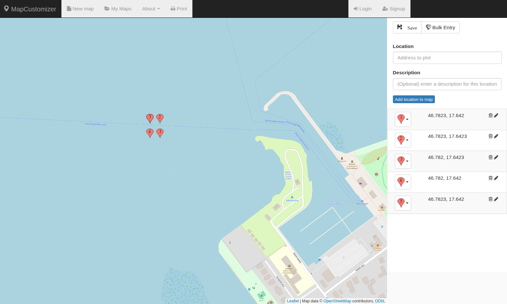
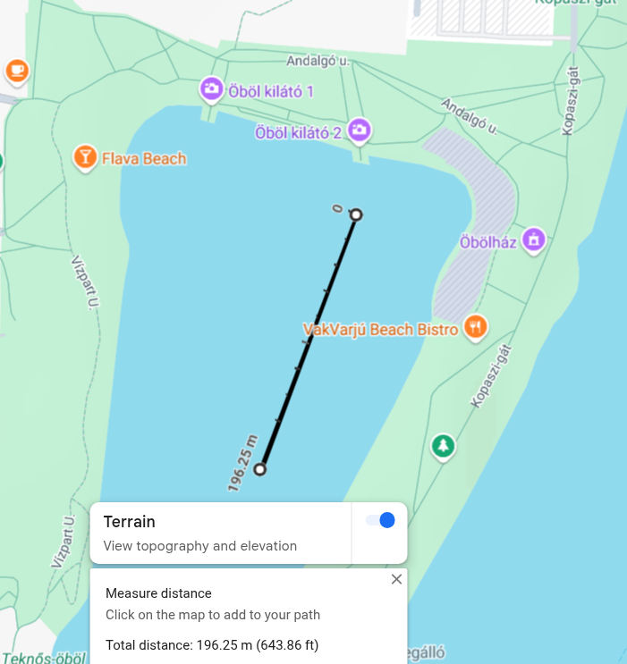
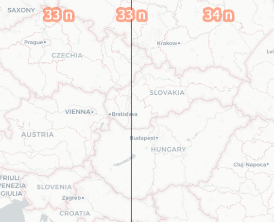
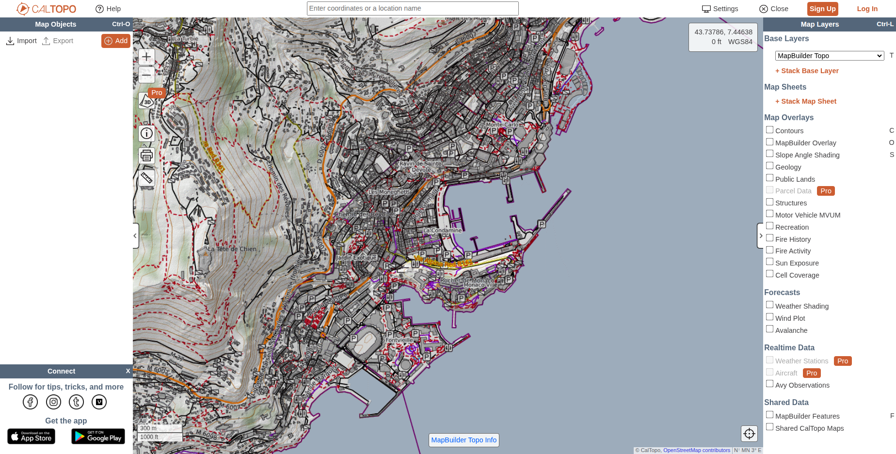

# **Mapping resources**

A collection of useful sites, links, tools and whatnot.

---

## Python packages

* [pyproj](https://pypi.org/project/pyproj/)

    * Has in-built object to help e.g transformation between coordinate systems.

---

## **Dynamic Tools**

Interactive interfaces

* [mapcustomizer](https://www.mapcustomizer.com/#)

    * Bulk import / visualize GPS coordinates

    

* [Google Maps](https://www.google.com/maps/place/46%C2%B046'56.1%22N+17%C2%B038'39.1%22E)

    * Tips:

        * Phone:

            * Tap user -> offline maps to download maps for offline access

        * PC:

            * Right click: copy gps coords; measure distance(s)

            

* [What UTM Zone am I in?](https://mangomap.com/robertyoung/maps/69585/what-utm-zone-am-i-in-)

    * Lets you easily find UTM codes on a world map

    

* [EPSG.io](https://epsg.io/transform#s_srs=4326&t_srs=32633&x=NaN&y=NaN)

    * Absolutely essential to validate / calculate tranformations between different coordinate systems!

---

## **Static tools**

Documents, high-res satellite imagery, etc.

* [World Imagery Wayback](https://livingatlas.arcgis.com/wayback/#active=56450&mapCenter=7.43190%2C43.73624%2C16)

* [Satellites Pro](https://satellites.pro/Monaco_map#43.736554,7.432293,16)

* [MarineTraffic](https://www.marinetraffic.com/en/ais/home/centerx:7.431/centery:43.736/zoom:16)

    * Shows live maritime traffic.

* [Scribble Maps](https://www.scribblemaps.com/create#/lat=43.73480524&lng=7.42524344&z=16&t=hybrid)

    * After login, can edit maps with loads of utilities.

* [CalTopo](https://caltopo.com/map.html#ll=43.73382,7.42221&z=15&b=mbt)

    * High-res with utilities

    
